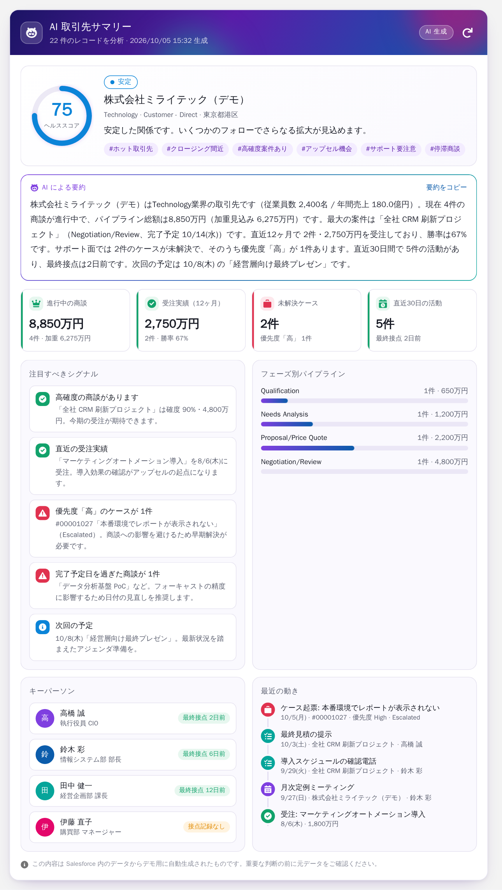
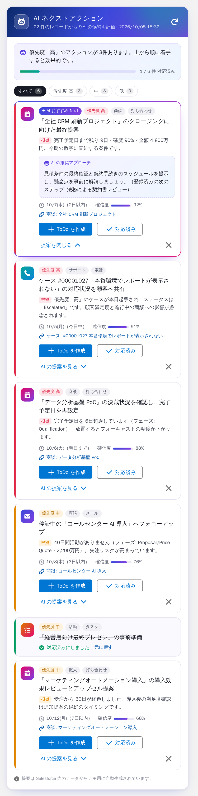

# 取引先 AI インサイト（Salesforce LWC デモ）

取引先の詳細画面に、AI が生成したような見た目の次の 2 つのコンポーネントを追加する Salesforce DX プロジェクトです。Developer Edition で動きます。

| コンポーネント | 内容 |
| --- | --- |
| **AI 取引先サマリー**（`accountAiSummary`） | ヘルススコア（リング表示）、ヘッドライン、タグ、AI 要約文（タイピング演出つき）、KPI、注目すべきシグナル、フェーズ別パイプライン、キーパーソン、最近の動き |
| **AI ネクストアクション**（`accountNextActions`） | 優先度順に並べた提案（根拠・推奨アプローチ・推奨期限・確信度・関連レコードへのリンク）、優先度での絞り込み、対応状況のプログレスバー、ワンクリックの ToDo 作成 |

| AI 取引先サマリー | AI ネクストアクション |
| --- | --- |
|  |  |

> 画像は、ローカルでサンプルデータを使って描画したプレビューです。実際の組織ではアイコンやボタンが Lightning 標準の見た目になり、フォントも組織の設定に従います。

## 「AI」の仕組み（デモ用）

外部の AI サービスとは連携していません。Apex（`AccountInsightsController`）が取引先に紐づく次のデータを集計し、ルールに沿って文章や提案を組み立てています。

- 商談（進行中・受注・失注、完了予定日、確度、最終活動日）
- ケース（未解決、優先度、経過日数）
- 取引先責任者（最終活動日）
- 活動（ToDo・行動。期限切れや今後の予定も含む）

主なルール

- **ヘルススコア**: 商談や受注実績、直近の活動、今後の予定があると加点し、優先度の高いケース、期限切れの ToDo、完了予定日を過ぎた商談があると減点します（5〜98 点）。
- **ネクストアクション**: 完了予定日を過ぎた商談、14 日以内にクロージングする商談、優先度「高」のケース、21 日以上活動のない商談、期限切れの ToDo、7 日以内の予定の準備、受注後のアップセル、90 日以上接点のないキーパーソンなどを検出します。優先度が高い順、影響度が大きい順に並べます。

レコードは実行ユーザーの権限で参照します（`WITH USER_MODE`）。データを変更するのは「ToDo を作成」ボタンだけです。

## デプロイ手順

### 1. 準備

- Developer Edition 組織（https://developer.salesforce.com/signup）
- [Salesforce CLI（`sf`）](https://developer.salesforce.com/tools/salesforcecli)

### 2. 組織にログインしてデプロイ

```bash
cd salesforce-account-ai-insights
sf org login web --alias ai-demo
sf project deploy start --source-dir force-app --target-org ai-demo --test-level RunSpecifiedTests --tests AccountInsightsControllerTest
```

> Developer Edition は本番組織と同じ扱いなので、Apex をデプロイするときにテストが実行されます。上のコマンドは同梱のテストクラスだけを実行します。

### 3. デモデータを作成（任意）

関連データがそろった取引先「株式会社ミライテック（デモ）」を作成します。何度実行しても作り直されます。

```bash
sf apex run --file scripts/apex/seedDemoData.apex --target-org ai-demo
```

CLI を使わない場合は、開発者コンソールの **Debug > Open Execute Anonymous Window** に `scripts/apex/seedDemoData.apex` の内容を貼り付けて実行してください。

### 4. 取引先ページに配置

1. 取引先レコードを開き、歯車アイコンから **[編集ページ]** を選び、Lightning アプリケーションビルダーを開きます。
2. 左側の **カスタム** にある「AI 取引先サマリー」をメイン領域の上部へ、「AI ネクストアクション」を右サイドバーへドラッグします。
3. **[保存]** をクリックし、**[有効化]** で組織のデフォルトとして割り当てます。

コンポーネントのプロパティ

- AI 取引先サマリー: 「タイピング演出をオフにする」
- AI ネクストアクション: 「表示する提案の最大件数」（1〜20、初期値 6）

## ローカルでの開発

```bash
npm install
npm run test:unit   # LWC の Jest テスト
npm run lint        # ESLint
```

## ファイル構成

```
force-app/main/default/
├── classes/
│   ├── AccountInsightsController.cls        # 集計と文章・提案の生成、ToDo 作成
│   └── AccountInsightsControllerTest.cls    # Apex テスト
└── lwc/
    ├── accountAiSummary/                    # AI 取引先サマリー
    └── accountNextActions/                  # AI ネクストアクション
scripts/apex/seedDemoData.apex               # デモデータ作成スクリプト
```

## カスタマイズのヒント

- 文言やしきい値（停滞とみなす日数など）は `AccountInsightsController.cls` の先頭にある定数と、各 `build*` メソッドで変更できます。
- 金額は、ユーザーの通貨が JPY なら「万円・億円」、それ以外なら「USD 1.2M」の形式で表示します。
- 本物の生成 AI を使う場合は、`buildNarrative` を Einstein の Prompt Builder（`ConnectApi.EinsteinLLM`）などの呼び出しに置き換えてください。画面側（LWC）は変更しなくても使えます。
